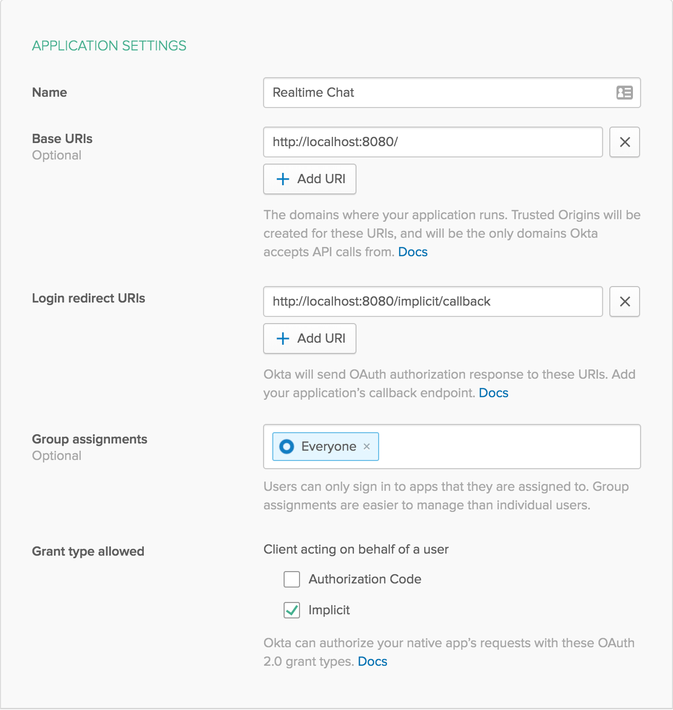

# Example App Using Node, TypeScript, and React

This example app shows how to create a simple real-time chat server using Node and TypeScript, as well as a frontend to interact with it using React. This uses Okta for authentication.

Please read [Build a Node.js API with TypeScript](https://developer.okta.com/blog/2019/05/07/nodejs-typescript-api) to see how this example was built.

**Prerequisites**: [Node.js](https://nodejs.org/en/).

## Getting Started

To install this example application, run the following commands:

```bash
git clone https://github.com/oktadeveloper/okta-node-express-typescript-react-example.git
cd okta-node-express-typescript-react-example
npm install
```

This will install a local copy of the project. You will need to set up some environment variables before the app will run properly.

To integrate Okta's Identity Platform for user authentication, you'll first need to:

* [Sign up for a free Okta Developer account](https://www.okta.com/developer/signup/)
* You will get a URL similar to `https://dev-123456.oktapreview.com`.
  * Save this URL for later
  * You will also use this URL to login to your Okta account

You will need to create an application in Okta:

* Log in to your Okta account, then navigate to **Applications** and click the **Add Application** button
* Select **Single-Page App** and click **Next**
* Give your application a name (e.g. "Real-Time Chat")
* Click **Done**
* Save your **Client ID** for later

Your Okta application should have settings similar to the following:



You'll also need to create a token in Okta:

* From your Okta account, navigate to **Tokens** from the **API** dropwon in the header
* Click **Create Token**
* Give your token a name (e.g. "Real-Time Chat")
* Click **Done**
* Save your **Token** for later (if you lose this, you'll need to create another one)

Now create a file called `.env` in the project root and add the following variables, replacing the values with your own from the previous steps.

**.env**
```bash
OKTA_ORG_URL=https://{yourOktaOrgUrl}
OKTA_CLIENT_ID={yourClientId}
OKTA_TOKEN={yourToken}
```

Now you can run both the Node backend and the React frontend with the following command:

```bash
npm start
```

## Links

This example uses the [Okta JWT Verifier](https://github.com/okta/okta-oidc-js/tree/master/packages/jwt-verifier), the [Okta Node SDK](https://github.com/okta/okta-sdk-nodejs), and the [Okta React SDK](https://github.com/okta/okta-oidc-js/tree/master/packages/okta-react).

## Help

Please [raise an issue](https://github.com/oktadeveloper/okta-node-express-typescript-react-example/issues) if you find a problem with the example application, or visit our [Okta Developer Forums](https://devforum.okta.com/). You can also email [developers@okta.com](mailto:developers@okta.com) if would like to create a support ticket.

## License

Apache 2.0, see [LICENSE](LICENSE).

